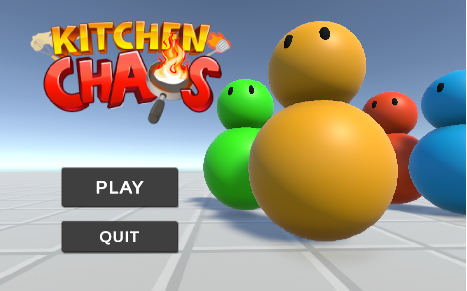
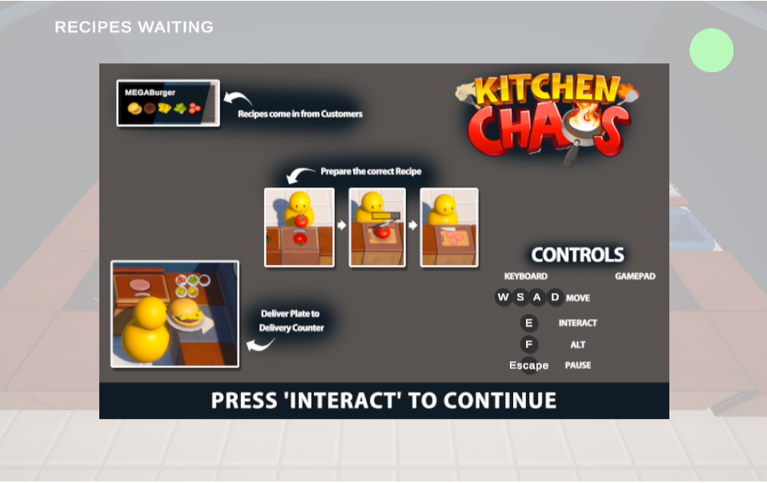
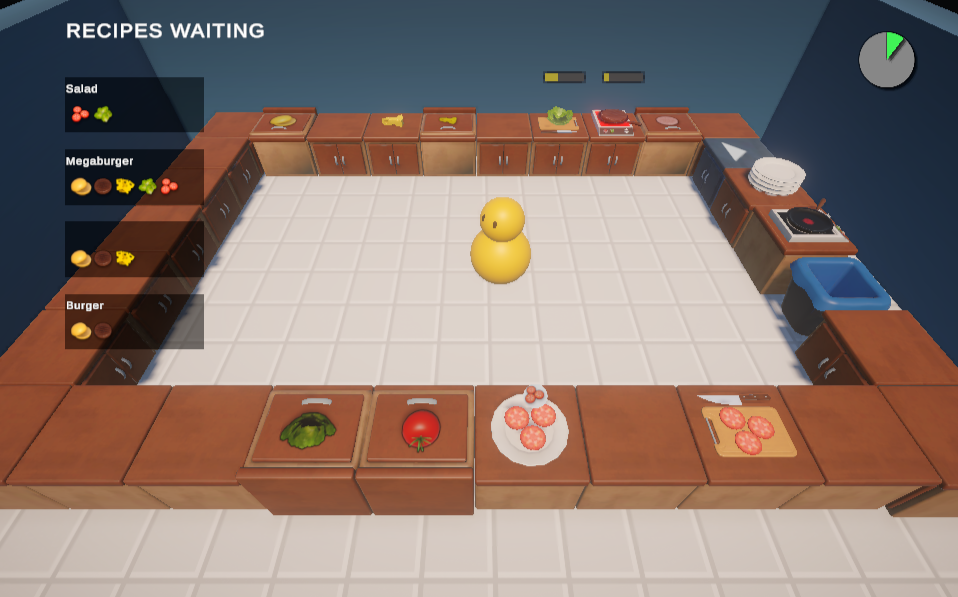
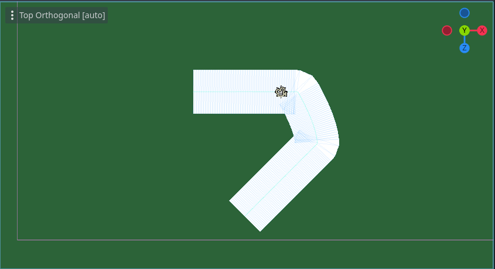
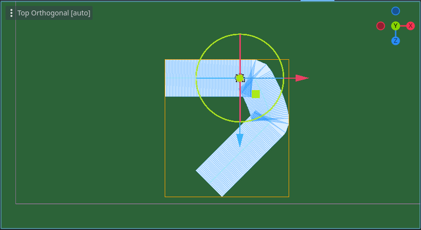
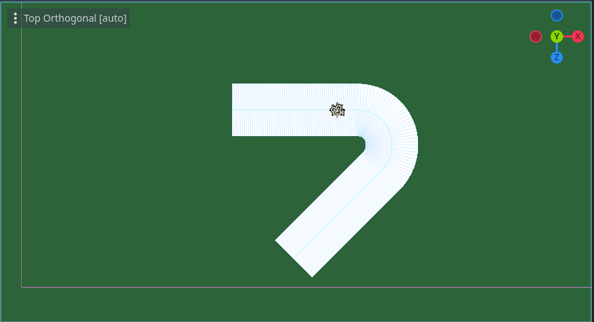
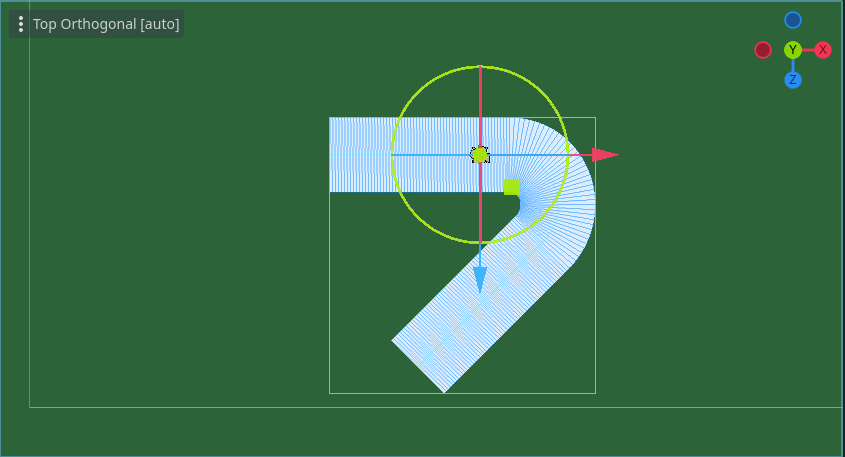

<h1> Nemanja Miletić - Backend Engineer and Aspiring Game Developer </h1>

    
    

    

<h4>
Hi, I'm Nemanja! 
Now I'm static, but who knows... 
Maybe when you visit next time I will be part of a game
</h4>

### What I Do

I'm a backend engineer and my main stack consists of <b>TypeScript, Node.js, NestJS, and PostgreSQL</b>. I enjoy designing scalable, efficient systems and solving challenging problems with <b>creative solutions</b>.

Currently, I'm working on my multiplayer game, where I get to combine my love for <b>math, problem-solving, and game development</b>.

### Backend Development

    <h3>
        <a href="https://honestdig.io/">Honestdig (AIM)</a>
    </h3>
    

        
    

    
Revolutionizing the mining industry with AI management

    <h3>
        <a href="https://carbooker.rs/en">Carbooker</a>
    </h3>
    

        
    

    
CarBooker offers a free personalized car rental service in Serbia, connecting you with reliable agencies.

### Game Development

<h3><a href="https://miletic94.github.io/kitchen-chaos/">Kitchen Chaos</a></h3>

    
    
    

> This game is for PC only. It isn't playable on other devices

I built this game to gain overview of game development in <b>Unity</b>.

I've got high overview of camera, animations, scenes, input system, UI, prefabs, scriptable objects, music and sound effects...

I couldn't have done it alone. Ask me about it.

<h3>Smooth curves</h3>

<h5>This is what I've got out of the box</h5>

    
    

<h5>This is what I've got after applying some math magic</h5>

    
    

Built <b>mathematical model</b> to solve the problem of self-intersecting meshes and jagged curves in <b>3D traffic management game</b>

It involved working with <b>Cubic Bezier Curves</b>, <b>Linear Algebra</b> and <b>Spline Tool</b>

<a href="https://miletic94.github.io/smoothing-guiding-curves/">Click to read blog post about the problem and solution</a>
